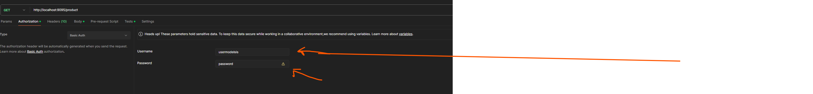
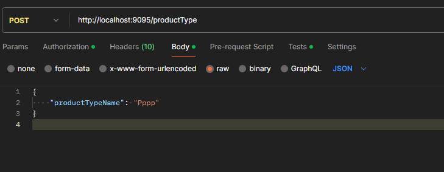
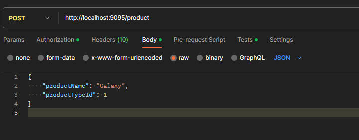

# modelsis-backend-Oumar-WADE
### 1. Intoduction du projet.

Ce projet nous permet de gérer le stockage des produits. On peut effectuer les opérations suivantes:
        
- Lister les produits
- AJouter un produit
- Modifier un produit
- Ajouter un nouveau type de produit

### 2. Stack utilisée.

Voici une description générale des composants intégrés dans le projet:

- Spring Boot 3.2.2:  La base même du projet, Spring Boot facilite la création d'applications Java autonomes, en fournissant une configuration par défaut et en minimisant la nécessité de configurations manuelles.
- Spring Web: Spring Web est une partie du framework Spring qui facilite le développement d'applications web Java 
- Spring Data JPA:  Une partie de la famille Spring Data, ce module simplifie l'accès aux bases de données relationnelles via Java Persistence API (JPA) en utilisant des annotations pour définir les entités et leurs relations.
- Spring Security : Un module de sécurité robuste qui permet de gérer l'authentification et l'autorisation dans l'application
- ModelMapper:  Son objectif principal est de simplifier le mappage entre deux modèles d'objets en éliminant la nécessité de coder manuellement les conversions de champ à champ.
- Maven: Un outil de gestion de projet qui simplifient la gestion des dépendances et la construction du projet.
- Lombok: Elle permet d'ajouter automatiquement des méthodes telles que les accesseurs (getters et setters), les constructeurs, les méthodes equals(), hashCode(), et d'autres, sans nécessiter une écriture explicite dans le code source.
- Postgres: C'est un SGBDR open source et  puissant
- Junit et Mockito: Des frameworks de test largement utilisés pour les tests unitaires et les tests d'intégration.
- Docker: Technologie nous permettant de créer des conteneurs.

### 3. Execution du projet

Voici la démarche à suivre pour executer le projets 

- Installer JDK 17 , Intellij Idea et Docker
- Ouvrir le terminal et vérifier que docker est bien installé en tapant la commande (docker -v)
- taper les commandes suivantes : 
  - docker pull postgres
  - docker run --name some-postgres -e POSTGRES_PASSWORD=testmodelsis -d postgres
  - vérifier que le conteneur est lancé avec la commande docker ps
- Cloner le projet via ce lien : https://github.com/omzowade95/modelsis-backend-Oumar-WADE.git
- Ouvrir le projet avec Intellij Idea et attendre le build du projet
- lancer le projet
- Installer Postman 
- Avant de lancer une requête s'authentifier comme suit avec les parametres suivants:
- Username: usermodelsis et password: password
- 
- Tester les requetes suivantes:
  - GET http://localhost:9095/product // la liste de tous les produits
  - GET http://localhost:9095/productType // La liste de tous les types de produit
- Pour ajouter ajouter un type de  produit:
  - POST http://localhost:9095/productType
  - 
- Pour ajouter ajouter un produit:
  - POST http://localhost:9095/product
  - 
  
